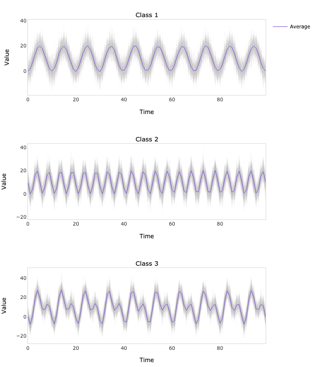
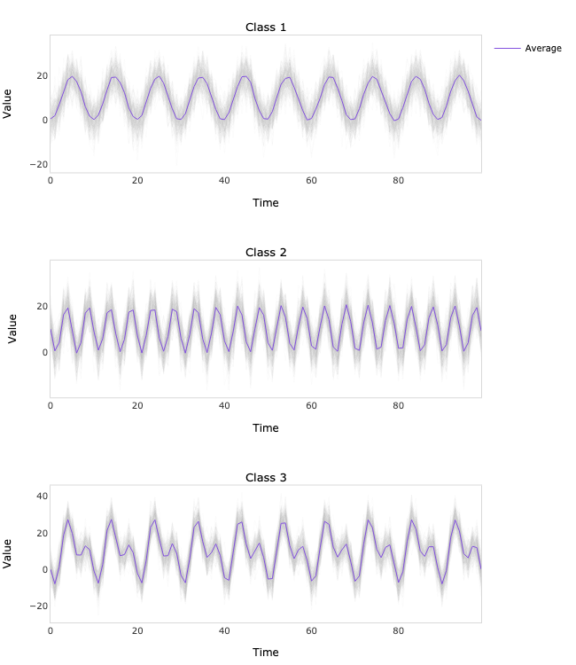

# LSTM-FCN PyTorch


PyTorch implementation of univariate time series classification model introduced in Karim, F., Majumdar, S., Darabi, H. and Chen, S., 2017. 
LSTM fully convolutional networks for time series classification. *IEEE access*, 6, pp.1662-1669. 
[https://arxiv.org/abs/1709.05206](https://arxiv.org/abs/1709.05206).

## Dependencies
```bash
numpy==1.23.1
torch==1.10.2
scikit-learn==1.1.2
plotly==5.9.0
kaleido==0.2.1
```
## Usage
```python
import numpy as np
from sklearn.model_selection import train_test_split
from sklearn.metrics import accuracy_score

from lstm_fcn_pytorch.model import Model
from lstm_fcn_pytorch.plots import plot

# Generate the data
N = 1500  # number of time series
L = 100   # length of each time series
x = np.zeros((N, L))
t = np.linspace(0, 1, L)
c = np.cos(2 * np.pi * (10 * t - 0.5))
s = np.sin(2 * np.pi * (20 * t - 0.5))
x[:N // 3] = 10 + 10 * c + 5 * np.random.normal(size=(N // 3, L))
x[N // 3: 2 * N // 3] = 10 + 10 * s + 5 * np.random.normal(size=(N // 3, L))
x[2 * N // 3:] = 10 + 10 * c + 10 * s + 5 * np.random.normal(size=(N // 3, L))
y = np.concatenate([0 * np.ones(N // 3), 1 * np.ones(N // 3), 2 * np.ones(N // 3)])

# Split the data
x_train, x_test, y_train, y_test = train_test_split(x, y, test_size=0.4, stratify=y)

# Train the model
model = Model(
    x=x_train,
    y=y_train,
    units=[5, 5],
    filters=[4, 4],
    kernel_sizes=[3, 3],
    dropout=0.2,
)

model.fit(
    learning_rate=0.001,
    batch_size=32,
    epochs=100,
    verbose=True
)

# Evaluate the model
yhat_train = model.predict(x_train)
yhat_test = model.predict(x_test)
print('Training accuracy: {:.6f}'.format(accuracy_score(y_train, yhat_train)))
print('Test accuracy: {:.6f}'.format(accuracy_score(y_test, yhat_test)))
```
```python
# Plot the training set predictions
fig = plot(x=x_train, y=yhat_train)
fig.write_image('train.png', width=650, height=750)
```

```python
# Plot the test set predictions
fig = plot(x=x_test, y=yhat_test)
fig.write_image('test.png', width=650, height=750)
```

